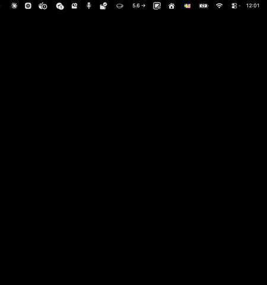

# DexBar

A lightweight macOS menu bar app that displays your Dexcom CGM glucose readings at a glance, with optional insulin bolus overlay from Glooko.




## Features

- Live glucose reading and trend arrow in the menu bar, updated every 60 seconds
- Popover chart showing up to 24 hours of readings
- Low glucose warning (highlighted in red below threshold)
- Optional Glooko integration — overlays insulin boluses and meal entries on the chart
- Credentials stored securely in the system Keychain
- Optional launch at login

## Requirements

- macOS (Apple Silicon or Intel)
- A [Dexcom Share](https://www.dexcom.com/en-us/dexcom-share) account

> **Note:** DexBar currently only works for users **outside the United States and Asia-Pacific** regions. This is a limitation of the Dexcom Share API endpoint used (`shareous1.dexcom.com`). US and Asia-Pacific users connect through a different regional endpoint which is not yet supported.

**Optional:** A [Glooko](https://glooko.com) account connected to an insulin pump. This enables the bolus/meal overlay on the chart.

## Getting Started

### Download a release (recommended)

1. Go to the [**Releases**](../../releases) page and download the latest `DexBar.zip`.
2. Unzip it and move **DexBar.app** to `~/Applications` (or `/Applications`).
3. Because the build is unsigned, macOS will quarantine it on first launch. Remove the flag by running:
   ```sh
   xattr -d com.apple.quarantine ~/Applications/DexBar.app
   ```
   Or right-click the app in Finder, choose **Open**, then confirm in the dialog.
4. Click the DexBar icon in the menu bar, then open **Preferences** and sign in with your Dexcom account credentials.
5. Optionally, sign in with your Glooko account in Preferences to enable the bolus/meal overlay.

### Build from source

1. Clone the repository and open `DexBar.xcodeproj` in Xcode.
2. Build and run the app (`⌘R`).
3. Click the DexBar icon in the menu bar, then open **Preferences** and sign in with your Dexcom account credentials.
4. Optionally, sign in with your Glooko account in Preferences to enable the bolus/meal overlay.

## Authentication

**Dexcom:** Authentication is performed against the Dexcom Share API using a two-step flow: account credentials are exchanged for an account ID, which is then exchanged for a session ID used for all subsequent data requests. This project's authentication implementation was informed by [**pydexcom**](https://github.com/gagebenne/pydexcom?tab=readme-ov-file) — a Python wrapper for the Dexcom Share API.

**Glooko (optional):** Authentication uses Glooko's private web API. A session cookie is obtained on sign-in and cached in the Keychain to avoid repeated logins across app restarts. The session is refreshed automatically when it expires.

## Contributing

Have an idea for a new feature or found a bug?

- **Feature request:** [Open an issue](../../issues/new) describing what you'd like to see and why it would be useful.
- **Bug report:** [Open an issue](../../issues/new) with steps to reproduce, your macOS version, and any relevant log output.
- **Pull request:** Contributions are welcome. Fork the repo, make your changes on a feature branch, and open a pull request with a clear description of what you changed and why.

## License

MIT License

Copyright (c) 2025 Oskar Hagberg

Permission is hereby granted, free of charge, to any person obtaining a copy of this software and associated documentation files (the "Software"), to deal in the Software without restriction, including without limitation the rights to use, copy, modify, merge, publish, distribute, sublicense, and/or sell copies of the Software, and to permit persons to whom the Software is furnished to do so, subject to the following conditions:

The above copyright notice and this permission notice shall be included in all copies or substantial portions of the Software.

THE SOFTWARE IS PROVIDED "AS IS", WITHOUT WARRANTY OF ANY KIND, EXPRESS OR IMPLIED, INCLUDING BUT NOT LIMITED TO THE WARRANTIES OF MERCHANTABILITY, FITNESS FOR A PARTICULAR PURPOSE AND NONINFRINGEMENT. IN NO EVENT SHALL THE AUTHORS OR COPYRIGHT HOLDERS BE LIABLE FOR ANY CLAIM, DAMAGES OR OTHER LIABILITY, WHETHER IN AN ACTION OF CONTRACT, TORT OR OTHERWISE, ARISING FROM, OUT OF OR IN CONNECTION WITH THE SOFTWARE OR THE USE OR OTHER DEALINGS IN THE SOFTWARE.

## Disclaimer

**This app is NOT a medical device and must NEVER be used as medical advice.**

> **DexBar is a personal hobby project and is not affiliated with, endorsed by, or in any way connected to Dexcom, Glooko, or any other company.**

### Personal Use Only

This app is intended strictly for personal, non-commercial use. It was built as a way to explore how diabetes-related data can be presented in a macOS status bar — nothing more. It is not intended for distribution, commercial use, or use by anyone other than the author.

See [DISCLAIMER.md](./DISCLAIMER.md) for full terms.
